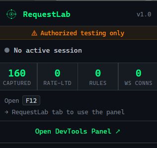
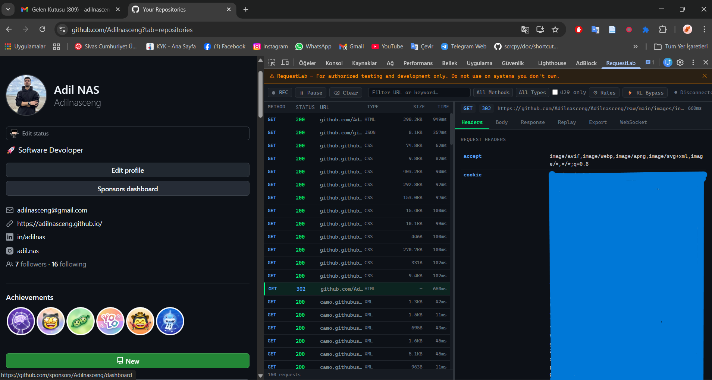
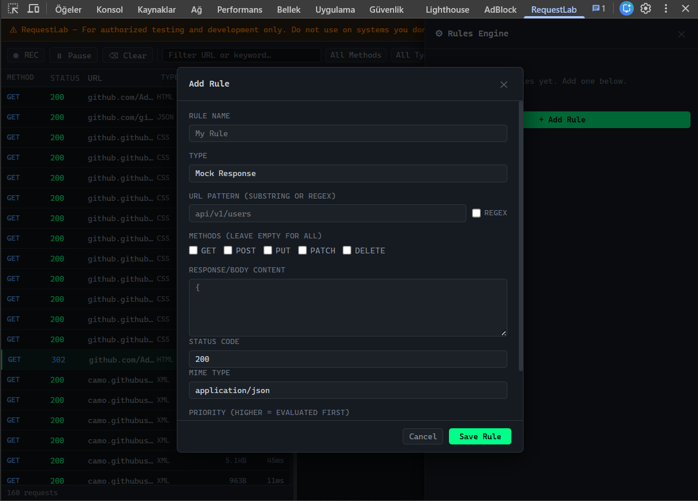
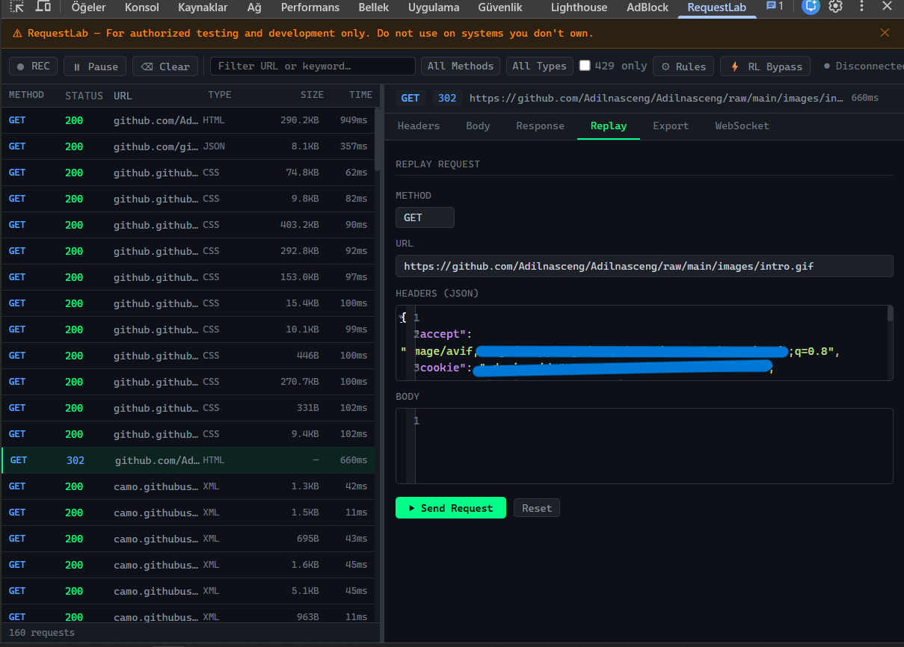

<div align="center">

# RequestLab

> A Chrome DevTools extension for intercepting, modifying, and reverse engineering HTTP requests.


</div>

---

## ⚠️ Disclaimer

> **For authorized testing and development only.**
> Do not use this tool on systems or APIs you do not own or have explicit permission to test.

---

## Features

| Feature | Description |
|---|---|
| **Request Interceptor** | Capture all XHR + Fetch requests in real time via `chrome.debugger` |
| **Request / Response Editor** | Modify headers, body, URL params before they are sent or received |
| **Rules Engine** | Persistent rules: mock responses, inject/remove headers, status overrides |
| **Rate Limit Bypass** | Strip `X-RateLimit-*` headers, rotate User-Agent, add request delays |
| **Replay** | Resend any captured request with edits applied |
| **Export** | Copy as `curl`, `fetch()`, or `Python requests` snippet |
| **API Reverse Engineering** | Auto-extract Bearer tokens, API keys, URL params |
| **WebSocket Monitor** | Log sent/received frames with timestamps, JSON pretty-print |

---

## Screenshots

<div align="center">



*Real-time request log with method, status, size, and timing*

<br/>



*Response body inspector with JSON syntax highlighting*

<br/>



*Rules engine — mock responses, header injection, status override*

<br/>



*Replay a request with edits, export as cURL / fetch / Python*

</div>

---

## Installation

**No build step required — load directly as an unpacked extension.**

1. Clone the repo:
   ```bash
   git clone https://github.com/Adilnasceng/requestlab.git
   ```

2. Open Chrome and go to:
   ```
   chrome://extensions
   ```

3. Enable **Developer mode** (top-right toggle).

4. Click **Load unpacked** and select the `requestlab/` folder.

5. The extension is now installed.

---

## Usage

1. Open any website you want to inspect.
2. Press `F12` to open Chrome DevTools.
3. Click the **RequestLab** tab in the DevTools panel.

### Intercepting Requests

All HTTP requests made by the page are logged automatically once the panel is open. Click any row to inspect headers, body, and response.

```
GET  200  /api/user/profile     JSON   1.2KB   43ms
POST 201  /api/comments         JSON   0.4KB  120ms
GET  429  /api/feed             JSON     —     12ms  ← rate limited
```

### Creating a Mock Rule

1. Click **⚙ Rules** in the toolbar.
2. Click **+ Add Rule**.
3. Set:
   - **Type:** `Mock Response`
   - **URL Pattern:** e.g. `api/user`
   - **Response Body:** your custom JSON
4. Click **Save Rule**.

All matching requests will now return your mock response without hitting the server.

### Replaying a Request

1. Click a request in the log.
2. Open the **Replay** tab on the right.
3. Edit the method, URL, headers, or body.
4. Click **▶ Send Request**.

### Exporting as Code

Open the **Export** tab on any selected request and choose:
- `cURL` — ready to paste in terminal
- `fetch()` — JavaScript snippet
- `Python` — `requests` library snippet

### Rate Limit Bypass

Click **⚡ RL Bypass** and enable:
- Strip `X-RateLimit-*` and `Retry-After` headers from outgoing requests
- Rotate User-Agent string on each request
- Add a configurable delay (ms) between requests

All 429 responses are logged separately with the `Retry-After` value displayed.

---

## File Structure

```
requestlab/
├── manifest.json               # MV3 manifest
├── background/
│   └── service_worker.js       # Debugger lifecycle, interception, rules engine
├── devtools/
│   ├── devtools.html           # DevTools entry page
│   ├── devtools.js             # Panel registration
│   ├── panel.html              # Main UI
│   ├── panel.js                # UI logic, virtual scroll, export
│   └── panel.css               # Dark theme styles
├── popup/
│   ├── popup.html              # Toolbar popup
│   ├── popup.js                # Quick stats
│   └── popup.css
├── lib/
│   └── codemirror/             # Bundled CodeMirror 5.65.16 (offline)
└── icons/
    └── icon.svg
```

---

## Permissions

| Permission | Reason |
|---|---|
| `debugger` | Attach to tabs to intercept requests via Chrome DevTools Protocol |
| `webRequest` | Monitor network activity |
| `declarativeNetRequest` | Apply persistent header injection / block rules |
| `storage` | Save rules and settings |
| `tabs` | Identify the inspected tab |
| `host_permissions: <all_urls>` | Intercept requests on any site |

> **Note:** Chrome will display a yellow banner — *"DevTools is being debugged by another tool"* — when the extension is active. This is expected behavior for any extension using the `chrome.debugger` API and cannot be suppressed.

---

## Tech Stack

- **Manifest V3** — service worker based, no persistent background page
- **Vanilla JavaScript** — no frameworks
- **Chrome DevTools Protocol** — `Fetch` domain for interception, `Network` domain for WebSocket monitoring
- **declarativeNetRequest** — for persistent header rules
- **CodeMirror 5** — bundled locally for JSON editing

---

<div align="center">

## License

This project is licensed under the [MIT License](LICENSE).

## Author

**Adil NAS** — [GitHub](https://github.com/Adilnasceng) · [Email](mailto:adilnasceng@gmail.com)

---

[](https://github.com/sponsors/Adilnasceng)

</div>
